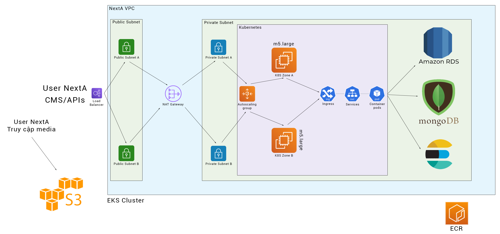
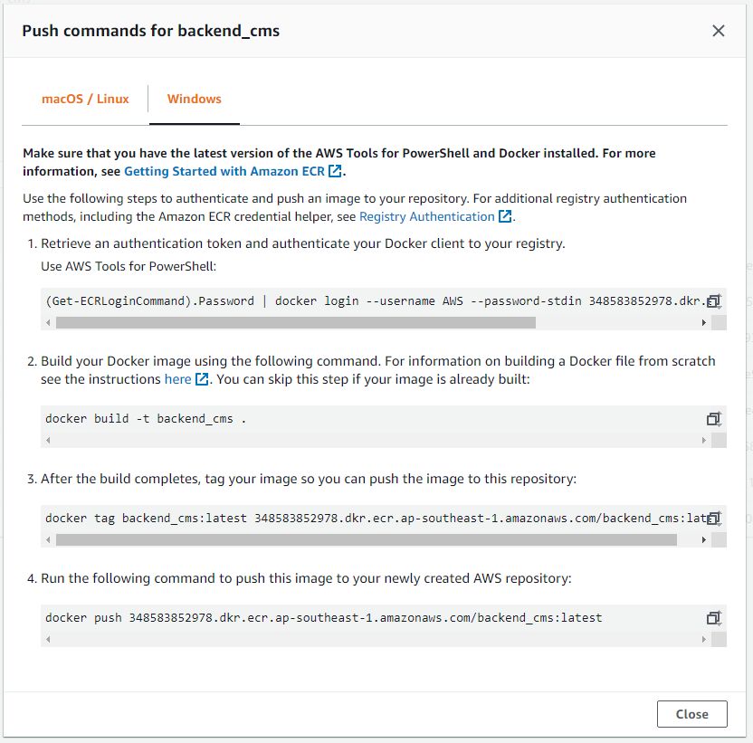
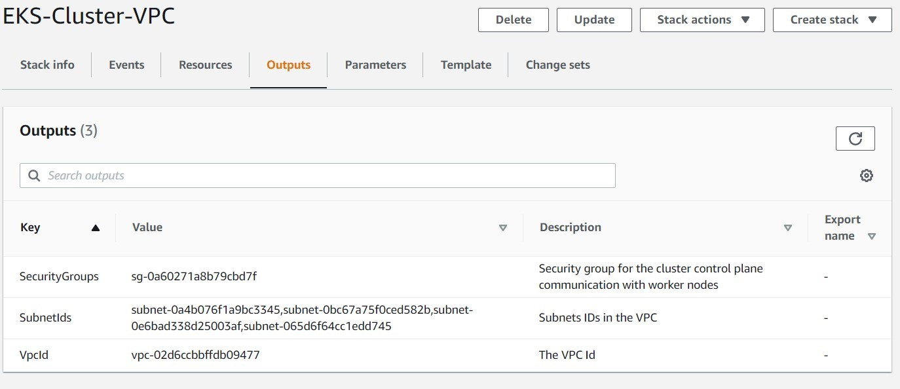
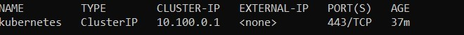
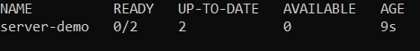
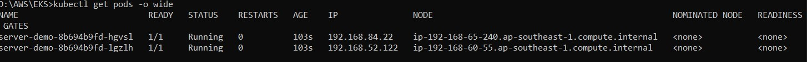

## <center>HƯỚNG DẪN TRIỂN KHAI HỆ THỐNG NEXTA LÊN AWS</center>

### Tổng quan cấu trúc



### Các tool cần có:
#### • [kubectl](https://kubernetes.io/docs/tasks/tools/install-kubectl/)
#### • [AWS CLI](https://docs.aws.amazon.com/cli/latest/userguide/clichap-configure.html)
#### • [AWS IAM Authenticator](https://docs.aws.amazon.com/eks/latest/userguide/install-aws-iam-authenticator.html)
#### • [eksctl](https://github.com/weaveworks/eksctl)

### Các bước thực hiện
#### Bước 1: Tạo SSH key
```sh
aws ec2 create-key-pair --key-name nexta-production --query 'KeyMaterial' --output text> nexta-production.pem
```
#### Bước 2: Tạo EKS Cluster
```sh
eksctl create cluster --name nexta-production --region ap-southeast-1 --nodegroupname nexta-production --nodes 2 --ssh-access --ssh-public-key nexta-production –managed
```
Theo dõi tiến độ tạo EKS Cluster [tại đây](https://ap-southeast-1.console.aws.amazon.com/cloudformation/home).
#### Bước 3: Cài đặt Elasticsearch trên EC2 - [Link nguồn](https://www.digitalocean.com/community/tutorials/how-to-install-and-configure-elasticsearch-on-ubuntu-18-04)
Bạn cần chạy các câu lệnh sau để có thể tạo Elasticsearch trên EC2:
```sh
curl -fsSL https://artifacts.elastic.co/GPG-KEY-elasticsearch | sudo apt-key add -
```
```sh
echo "deb https://artifacts.elastic.co/packages/7.x/apt stable main" | sudo tee -a /etc/apt/sources.list.d/elastic-7.x.list
```
```sh
sudo apt update
```
Cài đặt elasticsearch
```sh
sudo apt install elasticsearch
```
Sửa config
```sh
sudo nano /etc/elasticsearch/elasticsearch.yml
```
Chúng ta sửa `localhost` thành `ip của EC2`
```sh
. . .
# ---------------------------------- Network -----------------------------------
#
# Set the bind address to a specific IP (IPv4 or IPv6):
#
network.host: localhost
. . .
```
Sau đó thì restart elasticsearch
```sh
sudo systemctl start elasticsearch
```
#### Bước 4: Cài đặt Mongodb trên EC2 - [Link nguồn](https://www.digitalocean.com/community/tutorials/how-to-install-mongodb-on-ubuntu-18-04-source)
Để cài đặt được Mongodb trên EC2, chúng ta chạy các lệnh sau:
```sh
curl -fsSL https://www.mongodb.org/static/pgp/server-4.4.asc | sudo apt-key add -
```
```sh
echo "deb [ arch=amd64,arm64 ] https://repo.mongodb.org/apt/ubuntu bionic/mongodb-org/4.4 multiverse" | sudo tee /etc/apt/sources.list.d/mongodb-org-4.4.list
```
```sh
sudo apt update
```
Cài đặt mongodb
```sh
sudo apt install mongodb-org
```
Start mongodb service
```sh
sudo systemctl start mongod.service
```
Check status mongodb
```sh
sudo systemctl status mongod
```
Output:
```sh
● mongod.service - MongoDB Database Server
   Loaded: loaded (/lib/systemd/system/mongod.service; disabled; vendor preset: enabled)
   Active: active (running) since Tue 2020-10-06 15:08:09 UTC; 6s ago
     Docs: https://docs.mongodb.org/manual
 Main PID: 13429 (mongod)
   CGroup: /system.slice/mongod.service
           └─13429 /usr/bin/mongod --config /etc/mongod.conf
```
Enable mongodb service
```sh
sudo systemctl enable mongod
```

#### Bước 5: Tạo ECR repository
Tiến hành tạo các ECR cho các service nhỏ [tại đây](https://ap-southeast-1.console.aws.amazon.com/ecr/repositories?region=ap-southeast-1).
#### Bước 6: Build service và đẩy lên ECR bằng docker
Các command này bạn có thể tìm thấy nó tại phần `View push commands` trong các ECR repository bạn vừa tạo bên trên.



#### Bước 7: Tạo VPC
1. Đi tới bảng điều khiển CloudFormation và chọn Create Stack
2. Tại đây, hãy chọn nguồn mẫu làm URL Amazon S3 và cung cấp mẫu sau đã
được AWS tạo. (Ở đây tôi dùng mẫu [này](https://amazon-eks.s3.us-west-2.amazonaws.com/cloudformation/2020-06-10/amazon-eks-vpc-private-subnets.yaml))
3. Sau khi chọn mẫu xong
    1. VPC sẽ có địa chỉ CIDR là 192.168.0.0/16
    2. Tạo hai public subnets với blocks CIDR 192.168.0.0/18 và 192.168.64.0/18
    3. Tạo hai private subnets với blocks CIDR 192.168.128.0/18 và 192.168.192.0/18
4. Sau khi tạo xong, sẽ được như thế này



#### Bước 8: Tạo EKS Cluster with Workers
Ta tiến hành tạo một file có tên `cluster.yaml` và có nội dung như sau:
```sh
apiVersion: eksctl.io/v1alpha5
kind: ClusterConfig
metadata:
  name: EKS-Demo-Cluster
  region: ap-southeast-1

vpc:
  id: vpc-09ee0ce943b8c8d63
  cidr: "192.168.0.0/16"
  subnets:
    public:
      ap-southeast-1a:
        id: subnet-04257581011106487
      ap-southeast-1b:
        id: subnet-0684eb5ade0256973
    private:
      ap-southeast-1a:
        id: subnet-083e6c24a30ae4ed2
      ap-southeast-1b:
        id: subnet-083e6c24a30ae4ed2

nodeGroups:
  - name: EKS-public-workers
    instanceType: t2.medium
    desiredCapacity: 2
  - name: EKS-private-workers
    instanceType: t2.medium
    desiredCapacity: 1
    privateNetworking: true
```
Sau khi tạo xong, các giá trị chúng ta cần chỉnh sửa là:
1. Cluster name
2. VPC ID
3. Subnets id

#### Bước 9: Kiểm tra các service sau khi tạo
Chạy câu lệnh sau để kiểm tra các service:
```sh
kubectl get svc -n microservice
```
Kết quả:



#### Bước 10: Tạo ALB Controller
Sau khi clone code Nexta Backend về sẽ thấy 2 file là `alb-ingress-controller.yaml` và `ingresscontroller.yaml`

Chạy các lệnh sau để tạo ALB Controller:
1. `kubectl apply -f alb-ingress-controller.yaml`
2. `kubectl apply -f ingress-controller.yaml`
#### Bước 11: Deploy các service lên aws k8s
Truy cập vào từng service trong backend ta sẽ thấy file `deployment.yaml`, để triển khai nó lên k8s thì chúng ta chạy lệnh sau:
```sh
kubectl apply -f deployment.yaml
```
#### Bước 12: Kiểm tra xem các deployment, service được tạo thành công hay chưa
Để kiểm tra, chúng ta dùng lệnh:
1. `kubectl get deployments -n microservice`

    

2. `kubectl get services -n microservice`

    

Để kiểm tra các pods đang chạy, dùng lệnh: `kubectl get pods/nodes -o wide -n microservice`



#### *Note:*
1. Khi chúng ta build 1 bản image mới lên ECR repository thì chúng ta phải restart lại deployment để nhận code mới, dùng lệnh sau: `kubectl rollout restart deployment {tên service} -n microservice`